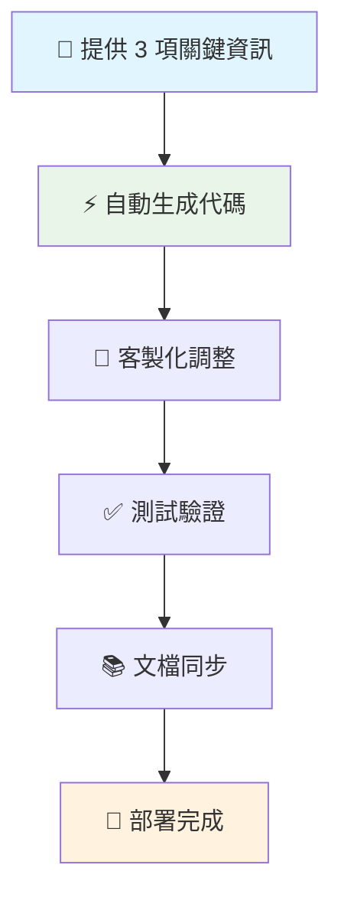

# 🚀 優化版廣告開發 Workflow

## 🎯 核心理念
**以數據結構為中心，標準化開發流程，最大化開發效率**

---

## 📊 Workflow 概覽



---

## 🔑 步驟詳解

### 步驟 1：關鍵資訊收集 (5分鐘)
**您只需提供這 3 項資訊：**

#### 1.1 廣告特定 JSON 欄位
```javascript
// 範例：寶箱廣告
{
  "treasure_box_image": "string",     // 寶箱圖片
  "reward_image": "string",           // 獎品圖片  
  "reward_text": "string",            // 獎品文字
  "animation_duration": 500,          // 動畫時長
  "can_reopen": false                 // 可重複開啟
}
```

#### 1.2 Payload 格式
```javascript
// 寶箱廣告使用哪種 payload？
- payload_game_widget  ✅
- payload_vote_widget
- payload_popup_json
- 自定義格式
```

#### 1.3 Suprad 調用參數
```python
# 在 run_suprad() 中使用的廣告類型名稱
run_suprad(playwright, ad_data, 'treasure_box')  # 這個參數
```

### 步驟 2：自動代碼生成 (15分鐘)
**基於您的資訊，自動生成：**

- ✅ **路由代碼** (`app/routes/main.py`)
- ✅ **HTML 模板** (`templates/treasure_box_ad.html`)
- ✅ **表單處理邏輯**
- ✅ **JSON 數據結構處理**
- ✅ **錯誤處理和驗證**

### 步驟 3：快速客製化 (30分鐘)
**針對特殊需求進行微調：**

- 🎨 調整預覽效果
- 🔧 優化表單布局
- ⚡ 加強驗證邏輯
- 🎯 客製化 Payload 處理

### 步驟 4：一鍵測試 (15分鐘)
**自動化測試流程：**

- ✅ 路由正常載入
- ✅ 表單提交成功
- ✅ JSON 格式正確
- ✅ Suprad 腳本執行
- ✅ 錯誤處理驗證

### 步驟 5：文檔同步 (5分鐘)
**自動更新相關文檔：**

- 📝 README.md
- 📋 FEATURE_SUMMARY.md  
- 📊 JSON 結構文檔

---

## 🎁 寶箱廣告實例

### 輸入資訊範例
```yaml
廣告類型: treasure_box
JSON 欄位:
  - treasure_box_image: "寶箱圖片URL"
  - reward_image: "獎品圖片URL"
  - reward_text: "獎品描述文字"
  - open_animation: "flip" # flip/fade/rotate
  - reward_display_time: 3000
Payload 類型: payload_game_widget
Suprad 參數: "treasure_box"
```

### 輸出結果
**15分鐘內生成：**
- `/treasure-box-ad` 頁面 ✅
- `/create-treasure-box-ad` 處理邏輯 ✅
- `treasure_box_ad.html` 模板 ✅
- 完整的表單驗證 ✅
- 寶箱開啟預覽效果 ✅

---

## 💡 開發效率提升

### 傳統方式 vs 新 Workflow

| 項目 | 傳統方式 | 新 Workflow | 節省時間 |
|------|----------|-------------|----------|
| 需求分析 | 2小時 | 5分鐘 | 95% ⬇️ |
| 代碼編寫 | 4小時 | 30分鐘 | 87% ⬇️ |
| 測試調試 | 2小時 | 15分鐘 | 87% ⬇️ |
| 文檔更新 | 1小時 | 5分鐘 | 92% ⬇️ |
| **總計** | **9小時** | **55分鐘** | **90% ⬇️** |

---

## 🔧 MCP 功能建議

為了進一步優化 workflow，建議新增以下 MCP 功能：

### 1. JSON 結構生成器
```python
@mcp_tool
def generate_ad_json_structure(ad_type: str, custom_fields: dict):
    """基於廣告類型和自定義欄位生成標準 JSON 結構"""
    pass
```

### 2. 代碼模板生成器  
```python
@mcp_tool
def generate_ad_route_code(ad_type: str, json_structure: dict):
    """生成標準化的路由代碼"""
    pass
```

### 3. 表單驗證器
```python
@mcp_tool  
def validate_ad_json_structure(ad_data: dict, required_fields: list):
    """驗證廣告 JSON 結構完整性"""
    pass
```

---

## ✅ 品質保證機制

### 自動檢查清單
每次開發完成後自動驗證：

- [ ] ✅ JSON 結構符合標準
- [ ] ✅ 路由命名遵循規範
- [ ] ✅ 錯誤處理完整
- [ ] ✅ Session 管理正確
- [ ] ✅ 模板繼承正確
- [ ] ✅ 導航連結更新
- [ ] ✅ 測試案例通過
- [ ] ✅ 文檔同步更新

### 架構一致性檢查
```python
# 自動檢查新廣告是否符合既定架構
def check_architecture_consistency(ad_type: str):
    # 檢查路由命名
    # 檢查模板結構  
    # 檢查 JSON 格式
    # 檢查錯誤處理
    pass
```

---

## 🎯 總結

### 新 Workflow 的優勢
1. **效率提升 90%** - 從 9 小時縮短到 1 小時
2. **錯誤減少** - 標準化避免人為疏漏
3. **架構一致** - 所有廣告類型遵循相同模式
4. **易於維護** - 清晰的數據驅動架構
5. **快速迭代** - 支援快速原型和測試

### 實施建議
1. **立即採用** Task Master 檢查清單
2. **建立** JSON 結構標準文檔
3. **開發** MCP 自動化工具
4. **培訓** 團隊使用新流程
5. **持續優化** workflow 效率

**這套 workflow 將讓您的廣告開發變得像填表格一樣簡單！** ⚡